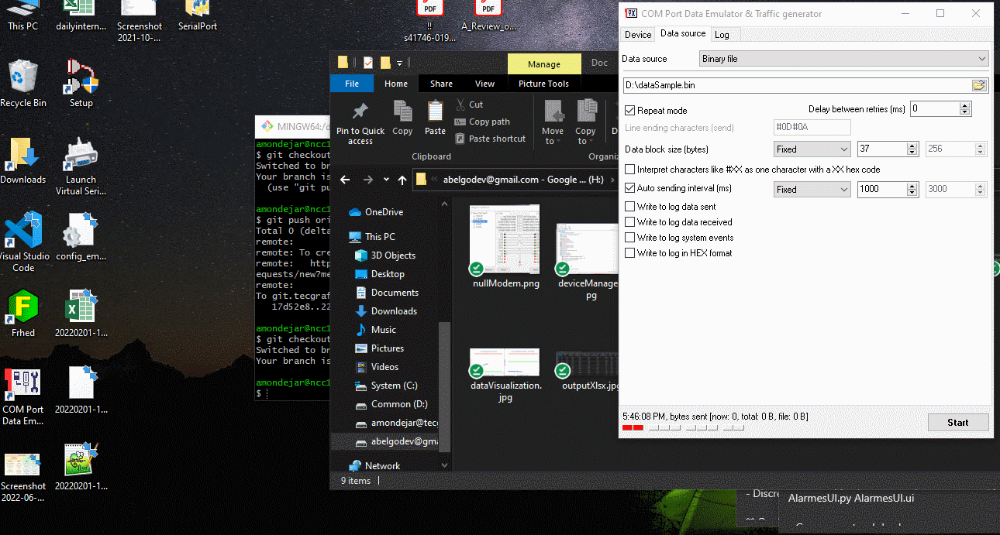

<h1 align="center">
   <p> COMPort 🐍</p>  
</h1>

<br>

<h1 align="center">
  
</h1>

---
## 🧾 About
**COMPort** is a Python project to capture a data stream from an Arduino device connected to a specific COM port. Also, it exports a binary file (.bin), a hexadecimal file (.hex), and an Excel file (.xlsx) at the end of the streaming session.

---
## 🕖 Versioning
- COMPort v2.0 (relased in 09/01/2022)
- COMPort v1.5 (relased in 11/10/2021)
- COMPort v1.0 (relased in 24/09/2021)

---
## ✅ Main features
- [x] Read data stream from COM port.
- [x] Sets buffer size.
- [x] Visualize data stream. 
- [x] Generate binary, hexadecimal and xlsx file.   

---
## 🔧 Technology
- [Python](https://www.python.org/) 💚

---
## 👨‍💻 How to Setup
```bash
  # Clone the project
  $ git clone https://github.com/abelgonzalez/COMPort.git
```
```bash
  # Enter directory
  $ cd COMPort
```

Download and install: 
 - [Python 3.7.7](https://www.python.org/downloads/release/python-377/)
 - [Visual Studio Code 1.67.2](https://code.visualstudio.com/Download)
 - [Null-modem emulator](https://sourceforge.net/projects/com0com/)
 - [COM Port Data Emulator](https://www.aggsoft.com/com-port-emulator/download.htm)
 - [Virtual Serial Port Driver](https://www.eltima.com/vspd-post-download.html?_ga=2.148845943.135235865.1634060891-52484055.1634060891)
 

---
## 😎 How to Run
 - Install [Null-modem emulator](https://sourceforge.net/projects/com0com/) and check that all parameters are like the image below:
<h1 align="center">
  
</h1>


Working here------->

 - 
 -   main.py:68, set the root project path were all Python projects are allowed. Example:
    DIR = r'C:\Users\abelg\GoDev\My Drive\Github'
 - In main.py:69, set the path were you want to export the requeriments.txt file. Example: 
    EXPORT_DIR = r'C:\Users\abelg\GoDev\My Drive\Github\UnifyRequirements'
 
 - In root folder (**UnifyRequirements**) run:
  ```bash
    # Run
    $ python main.py
  ```

---
## 👉 Additional information
* In case of sensitive bugs like security vulnerabilities, don't hesitate to contact me at abelgodev@gmail.com instead of using the issue tracker. I value your effort to improve the security and privacy of this project!

---
## 📝 License
This project is under the MIT license. See the file <a href="https://github.com/abelgonzalez/UnifyRequirements/LICENSE">LICENCE</a> for more details.

---
## 🧑‍💻 Autor
<p align="center">Done with 💙 by Abel González Mondéjar</p>


[](https://www.linkedin.com/in/abelgonzalezmondejar/)
