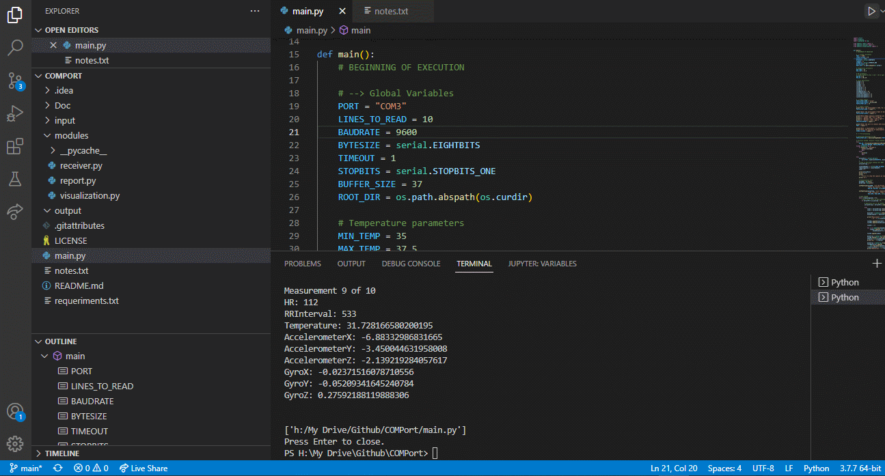
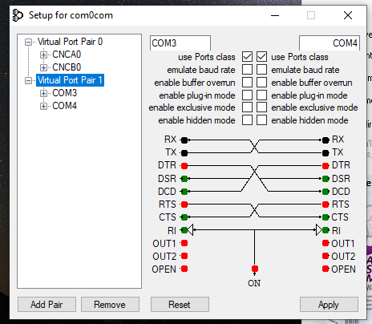
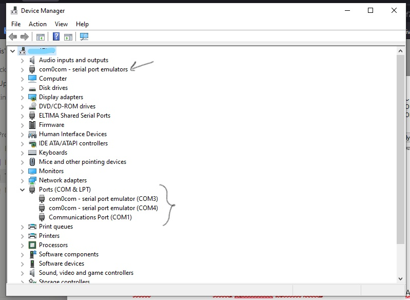
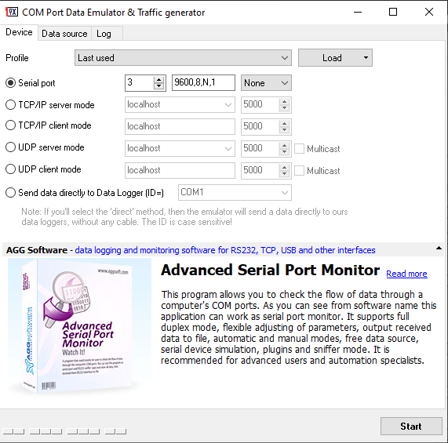
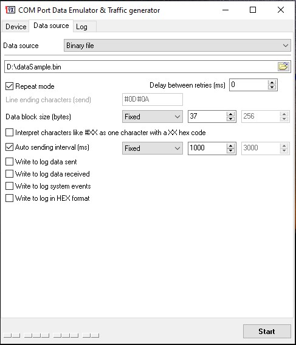
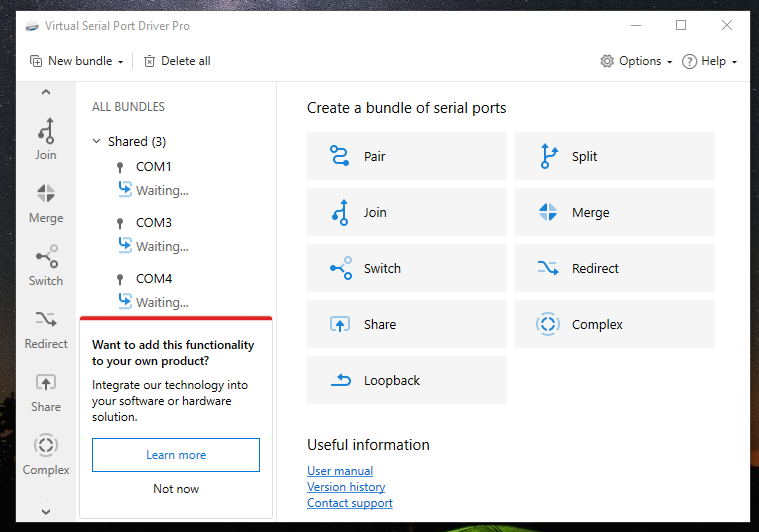
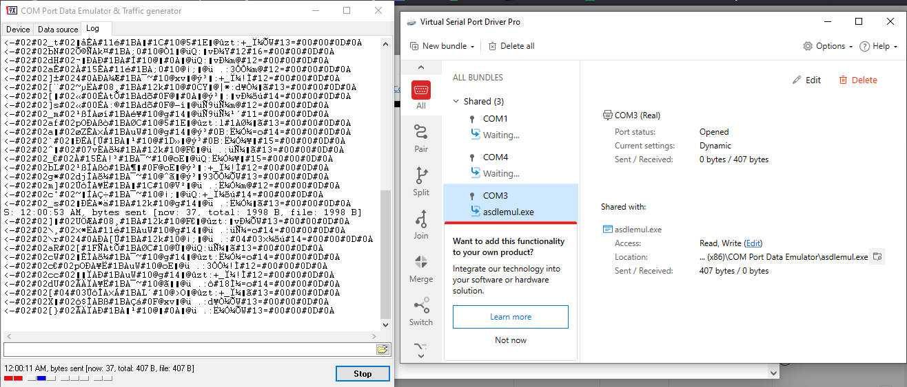
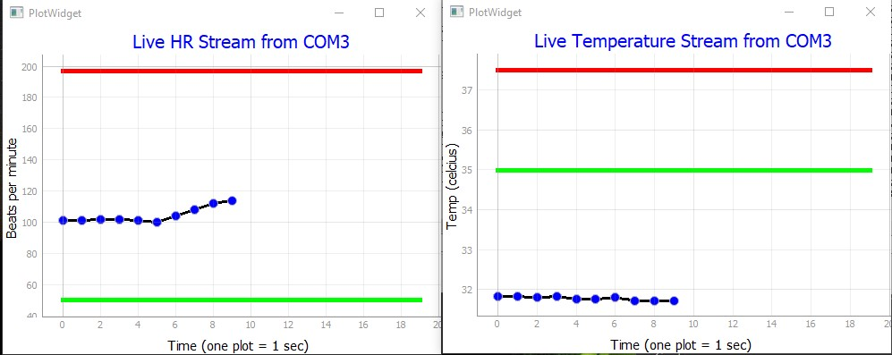
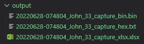
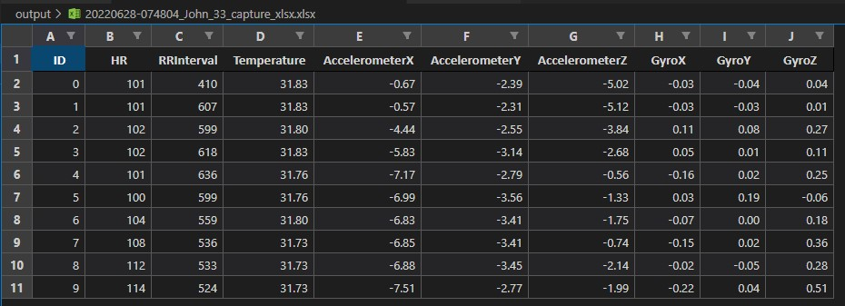

<h1 align="center">
   <p> COMPort 🐍</p>  
</h1>

<br>

<h1 align="center">
  
</h1>

---
## 🧾 About
**COMPort** is a Python project to capture a data stream from an Arduino device connected to a specific COM port. Also, it exports a binary file (.bin), a hexadecimal file (.hex), and an Excel file (.xlsx) at the end of the streaming session. To simulate Arduino Tx, we can use COM Port Data Emulator.

---
## 🕖 Versioning
- COMPort v2.0 (relased in 09/01/2022)
- COMPort v1.5 (relased in 11/10/2021)
- COMPort v1.0 (relased in 24/09/2021)

---
## ✅ Main features
- [x] Read data stream from COM port.
- [x] Visualize stream from HR and Temperature. 
- [x] Generate binary, hexadecimal, and xlsx file.   

---
## 🔧 Technology
- [Python](https://www.python.org/) 💚

---
## 👨‍💻 How to Setup
Download and install: 
 - [Python 3.7.7](https://www.python.org/downloads/release/python-377/)
 - [Visual Studio Code 1.67.2](https://code.visualstudio.com/Download)
 - [Null-modem emulator](https://sourceforge.net/projects/com0com/)
 - [COM Port Data Emulator](https://www.aggsoft.com/com-port-emulator/download.htm)
 - [Virtual Serial Port Driver](https://www.eltima.com/vspd-post-download.html?_ga=2.148845943.135235865.1634060891-52484055.1634060891)
 
 - Install [Null-modem emulator](https://sourceforge.net/projects/com0com/). This software creates a virtual portal (COM3, COM4) that we will use. When finished, it will ask to install a Virtual Device. Accept it.
In the end, check that all parameters are like the image below:
<h1 align="center">
  
</h1>

Also, check that the virtual ports are listed in Device Manager as follows:
<h1 align="center">
  
</h1>
Note: You may have a different COM number if your PC has other components.

- Install [COM Port Data Emulator](https://www.aggsoft.com/com-port-emulator/download.htm). This one generates the traffic needed for the COM port using data from a .bin file, located in input project folder.
In the end, check that all parameters in the Device menu are like the image below:
<h1 align="center">
  
</h1>

Also, check that the Data source is set as follows:
<h1 align="center">
  
</h1>

- Install [Virtual Serial Port Driver](https://www.eltima.com/vspd-post-download.html?_ga=2.148845943.135235865.1634060891-52484055.1634060891). This software allows us to view traffic and apps connected with COM ports. Once installed, click on "New bundle" / "Share" and select the COM3 port in the "Real port to share" option.
When finished, something similar to the image below should appear. This way, the Virtual Serial Port Drive listens to COM3, waiting for some activity.
<h1 align="center">
  
</h1>
   
```bash
  # Clone the project
  $ git clone https://github.com/abelgonzalez/COMPort.git
```
```bash
  # Enter directory
  $ cd COMPort
```
 
---
## 😎 How to Run
- Open the COM Port Data Emulator and Virtual Serial Port apps.
- In COM Port Data Emulator, click on the Start button
- The following should appear:
<h1 align="center">
  
</h1>
COM Port Data Emulator appears on the left, indicating that Tx information is present. On the right, Virtual Serial Port Driver Pro informs that COM3 is being used and has some active activity.

Now, we will run our script.
 
- In root folder (**COMPort**) run:
  ```bash
    # Run
    $ python main.py
  ```
- It will appear "Enter the participant's name. Ex: Lucas" message. Fill it and press Enter
- Then, it will appear "Enter the participant's date of birth in DD/MM/YYYY format. Ex: 20/10/1996". Insert it with DD/MM/YYYY format and press Enter.
- Then,  "Which HRmax analysis method do you want to use? Enter the number only. Ex: 1" message appears. Pick one and press Enter.
- Insert the COM port in the "Enter the port to connect and press Enter. Ex: COM3" message and press Enter.
- Finally, define how many seconds you want to capture in the "Enter the number of measurements to capture and press Enter. Ex: 10" message. Insert it and press Enter.

We will see all data Tx and visualizations of HR and Temperature as follow:
<h1 align="center">
    
</h1>

<h1 align="center">

</h1>

At the end of execution, in the output folder, we will see exported files (binary, hexadecimal, and xlsx) as follow:
<h1 align="center">
  
</h1>

Excel file will contain in columns all features captured and rows, the instances read from COM Port Data Emulator as follow:
<h1 align="center">
  
</h1>

Note:
- Check that the info is being Tx through COM3. If you use a different COM port, set it in COM Port Data Emulator.
- After installing all the components, restart the computer if the reception of data in Python is not working.

---
## 👉 Additional information
* In case of sensitive bugs like security vulnerabilities, don't hesitate to contact me at abelgodev@gmail.com instead of using the issue tracker. I value your effort to improve the security and privacy of this project!

---
## 📝 License
This project is under the MIT license. See the file <a href="https://github.com/abelgonzalez/COMPort/LICENSE">LICENCE</a> for more details.

---
## 🧑‍💻 Autor
<p align="center">Done with 💙 by Abel González Mondéjar</p>


[](https://www.linkedin.com/in/abelgonzalezmondejar/)
